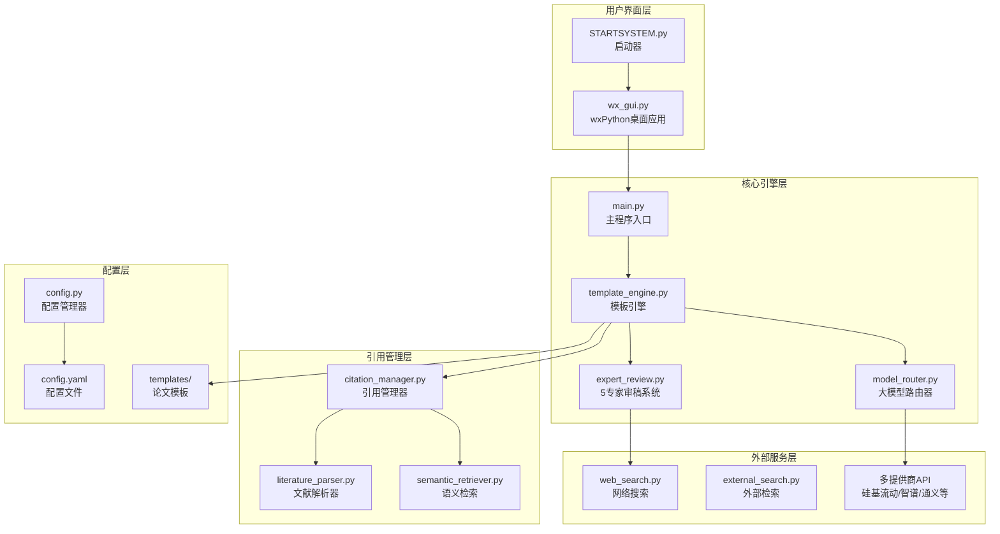
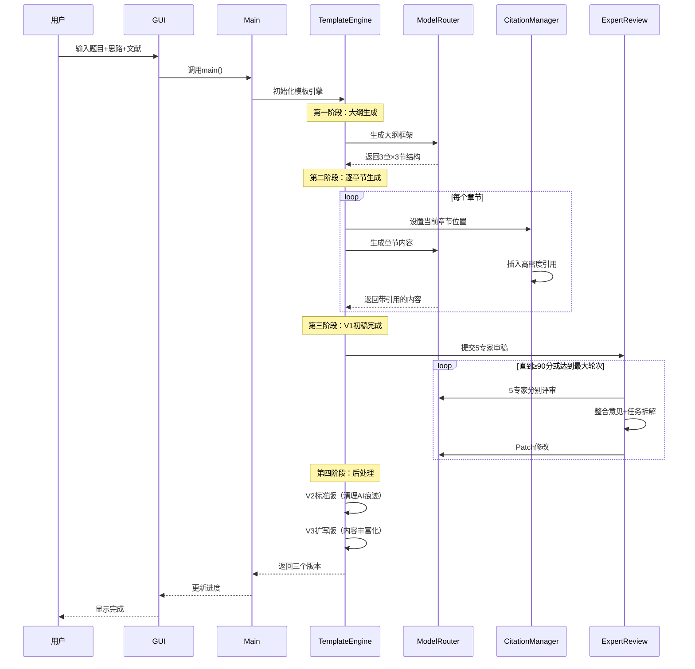

# 自动化论文生成系统 - 项目分析报告

## 📋 项目概述

这是一个**模板驱动的哲学社科理论论文自动写作流水线**，完全依赖在线大模型API（纯线上版），无需配置本地模型。

### 核心定位
- **目标用户**: 需要生成学术论文的研究人员
- **论文类型**: 哲学社科理论论文
- **核心特点**: 高密度引用、多专家审稿、智能文献管理

---

## 🏗️ 系统架构



---

## 📁 目录结构详解

```
D:\自动化论文带数据分析\
├── 🚀 启动入口
│   ├── STARTSYSTEM.py      # 项目启动器（杀死旧进程+启动GUI）
│   ├── wx_gui.py           # wxPython桌面GUI（主界面）
│   └── main.py             # 主程序（命令行入口）
│
├── 📦 核心模块 (core/)
│   ├── template_engine.py  # 模板引擎（1837行，核心！）
│   ├── model_router.py     # 大模型路由器（多提供商支持）
│   ├── citation_manager.py # 引用管理器（高密度引用策略）
│   ├── expert_review.py    # 5专家AI审稿系统
│   ├── literature_parser.py# 文献解析器（TXT格式）
│   ├── semantic_retriever.py# FAISS语义检索
│   ├── web_search.py       # Web搜索集成
│   ├── external_search.py  # 外部检索补充
│   ├── docx_exporter.py    # Word导出
│   ├── pdf_reference.py    # PDF参考管理
│   └── project_manager.py  # 项目管理器
│
├── ⚙️ 配置文件
│   ├── config.py           # 配置管理器（单例+观察者模式）
│   ├── config.yaml         # 主配置文件
│   └── templates/
│       └── theoretical_paper.yaml  # 理论论文模板
│
├── 📊 数据目录 (data/)
│   ├── projects/           # 每个论文项目独立文件夹
│   └── temp/               # 临时文件
│
├── 🛠️ 工具脚本
│   ├── build.spec          # PyInstaller打包配置
│   ├── build_exe.bat       # 打包脚本
│   ├── installer.iss       # Inno Setup安装包配置
│   └── requirements.txt    # Python依赖
│
└── 📤 输出目录 (output/)
    └── [生成的论文文件]
```

---

## 🔧 核心模块分析

### 1. 模板引擎 (`template_engine.py`) - 1837行
> **职责**: 解析模板YAML，驱动整个论文生成流程

**核心功能**:
- `generate_paper()` - 主生成流程，分章节生成MD文档
- `_generate_introduction()` - 生成引言
- `_generate_subsection()` - 生成二级标题内容
- `_generate_conclusion()` - 生成结论
- `_expand_dynamic_sections()` - 展开动态章节（AI设计框架后分别展开）
- `optimize_paper_sections()` - V2结构保留优化
- `expand_full_paper_content()` - V3全文扩写

**生成流程**:
```
生成大纲 → 引言 → 主体章节（3章×3节）→ 结论 → 摘要 → 参考文献
          ↓
      V1初稿 → V2标准版（清理AI痕迹）→ V3扩写版（内容丰富化）
```

---

### 2. 大模型路由器 (`model_router.py`) - 401行
> **职责**: 统一管理多个在线API提供商

**支持的提供商**:
| 提供商 | API地址 | 主要模型 |
|--------|---------|----------|
| 硅基流动 | api.siliconflow.cn | Qwen3-30B-A3B |
| 智谱AI | open.bigmodel.cn | GLM-4系列 |
| 通义千问 | dashscope.aliyuncs.com | Qwen-Max/Plus |
| DeepSeek | api.deepseek.com | DeepSeek-Chat |
| OpenAI | api.openai.com | GPT-4/GPT-3.5 |

**阶段模型配置** (`stage_models`):
- `outline`: 大纲生成 - 快速模型
- `content`: 正文内容 - 标准模型
- `review`: 专家审稿 - 深度思考模型（启用thinking）
- `expansion`: 扩写 - 高创造性模型

---

### 3. 引用管理器 (`citation_manager.py`) - 535行
> **职责**: 实现高密度、不重复引用策略

**引用配置**:
```yaml
citation:
  target_per_sentence: 3    # 每句目标引用数
  min_per_paragraph: 5      # 每段最低引用数
  max_per_paragraph: 15     # 每段最高引用数
  max_total: 20             # 总引用数上限
  similarity_threshold: 0.6 # 相关性阈值
  diversity_weight: 0.3     # 多样性权重
```

**核心方法**:
- `generate_sentence_with_citations()` - 为句子插入引用
- `_diverse_selection()` - 多样性选择（分散作者/年份）
- `validate_and_fix_distribution()` - 验证并修复引用分布
- `sync_with_text()` - 同步正文引用与tracker

---

### 4. 5专家AI审稿系统 (`expert_review.py`) - 1081行
> **职责**: 多轮审稿优化，直到达到目标分数

**5位专家**:
1. **创新点专家** - 评估论点新颖性
2. **逻辑专家** - 评估论证逻辑性
3. **准确性专家** - 评估内容准确性
4. **规范性专家** - 评估格式规范性
5. **整合专家** - 综合评分+改进建议

**审稿流程**:
```
V1初稿 → 5专家评审 → 整合意见 → 任务拆解 → Patch修改 → 
         ↑                                           ↓
         └─────── 评分<90分？继续优化 ←──────────────┘
```

**Patch-Based修改策略**:
- 定位具体段落，微创修改
- 每次只关注300-500字
- 杜绝全量重写导致的结构崩坏

---

### 5. wxPython GUI (`wx_gui.py`) - 1442行
> **职责**: 桌面用户界面

**主要功能**:
- 论文项目配置（标题、关键词、核心思路）
- 文献池上传
- 大纲预览与编辑（`OutlineEditorDialog`）
- 生成进度显示
- 历史记录管理
- 模型配置（提供商、API Key、参数）

**界面结构**:
```
MainFrame
├── 任务标签页 (create_task_tab)
│   ├── 项目配置区
│   ├── 文献上传区
│   ├── 生成控制区
│   └── 进度显示区
├── 配置标签页 (create_config_tab)
│   ├── 提供商选择
│   ├── API Key设置
│   ├── 模型参数设置
│   └── 专家审稿配置
└── 搜索标签页 (create_search_tab)
```

---

## 📝 论文模板分析 (`theoretical_paper.yaml`)

### 章节结构
| 章节ID | 标题 | 字数目标 | 引用配置 |
|--------|------|----------|----------|
| abstract | 摘要 | 300字 | 0引用 |
| introduction | 一、引言 | 1800-2500字 | 10+引用，每句3个 |
| main_body_structure | 二~四、主体 | 动态3章×3节 | 每节8+引用 |
| conclusion | 结论 | 800-1000字 | 2+引用 |

### 动态章节展开
```yaml
- id: "main_body_structure"
  dynamic: true
  expand_count: 3  # 展开为3个主体章节
  
- id: "main_body_template"
  is_template: true
  sub_sections: 3  # 每章3个二级标题
```

---

## 🔄 生成流程



---

## 💡 当前系统的优势

1. **多提供商支持** - 灵活切换API，成本可控
2. **高密度引用** - 自动插入引用，学术规范
3. **5专家审稿** - 多角度评审，质量保障
4. **动态章节** - AI设计框架，内容丰富
5. **三版本输出** - 初稿→标准→扩写，满足不同需求
6. **Patch修改** - 微创优化，避免结构崩坏

---

## ⚠️ 当前系统的局限

1. **仅支持理论论文** - 无实证研究/数据分析模板
2. **引用仅来自TXT文献池** - 无法自动获取真实文献
3. **专家审稿依赖AI** - 可能存在评分不准确
4. **无数据处理能力** - 不支持表格、图表、数据分析
5. **单一模板结构** - 固定3章×3节，灵活性有限
